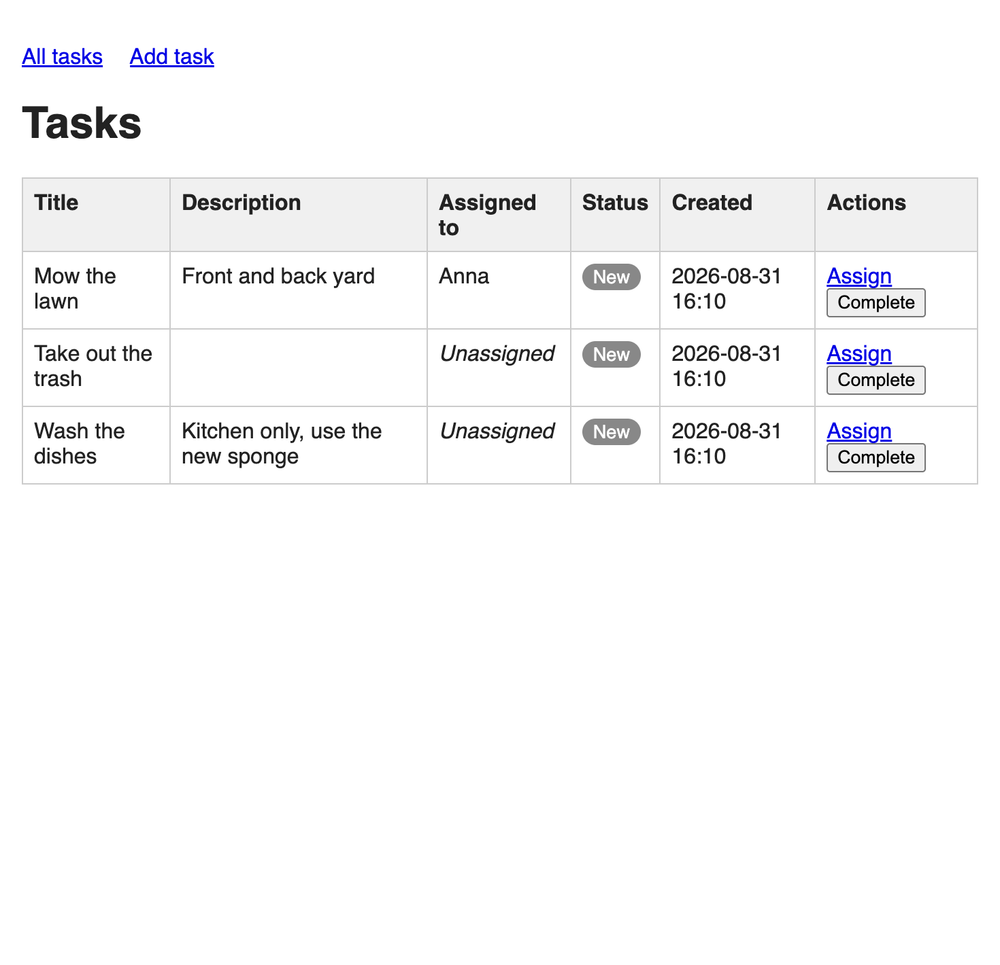

# Household Chores Manager

MVP project for [AI Dev Tools Zoomcamp 2026](https://datatalks.club/) Homework 1.

A simple web app for a household to track chores: anyone can add a task,
assign it to a household member, and mark it as done.



## Features

- **Add a task** — create a chore with a title and description
- **Assign a user** — assign an existing task to a household member (users are just names, no auth)
- **Mark as done** — complete a task; its status becomes "Done"
- **View the list** — see all tasks with assignee, status (New / In Progress / Done) and creation date

## Tech stack

- [Django](https://www.djangoproject.com/) 6.1
- SQLite (default)
- Dependencies managed with [uv](https://docs.astral.sh/uv/)
- Testing with [pytest](https://docs.pytest.org/) + pytest-django

## Quick start

```bash
# install dependencies
uv sync

# apply migrations
uv run python manage.py migrate

# run the dev server
uv run python manage.py runserver
```

Open http://127.0.0.1:8000/ in your browser.

## Tests

```bash
uv run pytest
```

## Project structure

```
household-chores/
├── household_chores/        # Django project settings and URLs
├── tasks/                   # the chores app
│   ├── models.py            # Task model
│   ├── forms.py             # TaskForm, AssignForm
│   ├── views.py             # list, create, assign, complete views
│   ├── urls.py
│   ├── templates/tasks/     # HTML templates
│   └── test_tasks.py        # pytest tests
├── _docs/                   # spec and workflow documents
│   ├── plan.md              # product specification
│   ├── process.md           # how work is organized
│   ├── task-template.md     # groomed task template
│   └── team/                # PM / engineer / QA role definitions
├── backlog.md               # task backlog
└── AGENTS.md                # context for AI coding agents
```

## How it was built (AI-native workflow)

This project follows the AI-native development workflow from
[AI Dev Tools Zoomcamp](https://datatalks.club/) Part 1:
spec-driven development, a groomed backlog, and role separation between
PM, engineer and QA agents.

1. **Spec first** — `_docs/plan.md` defines scope and tech stack before any code.
2. **Backlog** — `backlog.md` decomposes the spec into six small tasks, each
   doable in one session.
3. **Context engineering** — `AGENTS.md` gives any coding agent (Codex,
   OpenCode, Claude Code) the commands, rules and a map of the documents.
4. **Role separation** — the PM grooms a task into checkable acceptance
   criteria (`_docs/team/pm.md`, `_docs/task-template.md`), the engineer
   implements it (`_docs/team/software-engineer.md`), and QA verifies it
   against the criteria, outputting PASS or FAIL (`_docs/team/qa-engineer.md`).
   The orchestrator lifecycle is described in `_docs/process.md`.
5. **Verification** — every task is covered by tests (`uv run pytest`) and
   checked against the running app.

## Docs

- `_docs/plan.md` — product specification
- `backlog.md` — the backlog (all 6 tasks are implemented)
- `AGENTS.md` — commands and rules for AI coding agents
- `_docs/process.md` — workflow: PM grooms → engineer implements → QA verifies
